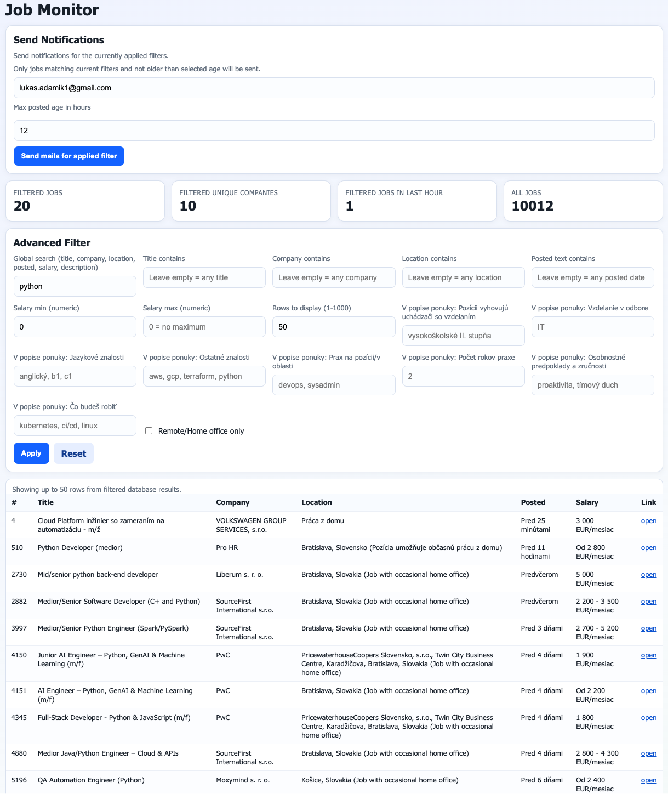

# CVsender

CVsender is a local job-monitoring tool focused on IT listings from `profesia.sk`.
It continuously ingests jobs into MySQL, lets you apply advanced filters in a web UI,
and can send email notifications for jobs matching your currently applied filters.

## UI Preview



## What This Software Does

- Scrapes job listings (title, company, location, posted date, salary, URL, description).
- Stores and updates jobs in MySQL with deduplication by normalized URL.
- Runs a background updater loop to refresh listings on a fixed interval.
- Provides advanced filtering in UI:
  - global search
  - title/company/location/posted filters
  - numeric salary min/max
  - remote/home-office-only
  - section-based filters from parsed job description text
- Sends SMTP digest emails for currently applied filters and max job age in hours.
- Includes standalone scraping export via Scrapy (`jobs.csv`, `jobs.xlsx`).

## Main Components

- `web_app.py`: Flask web app, updater thread, filters, SMTP notifications.
- `mysql_store.py`: DB schema management, upsert/load logic, salary parsing.
- `templates/index.html`: Job Monitor UI.
- `main.py`: Scrapy spider for CSV/XLSX export and detail description extraction.
- `docker-compose.yml`: Optional local MySQL service.

## Quick Start

1. Start MySQL (optional if you already have MySQL running):

```bash
docker compose up -d mysql
```

2. Create and activate virtual environment, then install dependencies:

```bash
python3 -m venv .venv
source .venv/bin/activate
pip install flask pandas requests parsel pymysql scrapy openpyxl
```

3. Run the web app:

```bash
python web_app.py
```

4. Open:

`http://127.0.0.1:5000`

## Useful Environment Variables

MySQL:
- `MYSQL_HOST` (default `127.0.0.1`)
- `MYSQL_PORT` (default `3306`)
- `MYSQL_USER` (default `jobs_user`)
- `MYSQL_PASSWORD` (default `jobs_pass`)
- `MYSQL_DATABASE` (default `jobs_db`)

Updater / app:
- `UPDATE_INTERVAL_SEC` (default `1`)
- `DESCRIPTION_BACKFILL_BATCH` (default `1`)
- `FLASK_SECRET_KEY` (default `change-me`)

Notification defaults:
- `NOTIFY_TO_EMAIL`
- `NOTIFY_MAX_AGE_HOURS` (default `24`)
- `SMTP_HOST`, `SMTP_PORT`, `SMTP_USER`, `SMTP_PASSWORD`, `SMTP_FROM`
- `SMTP_STARTTLS` (default enabled), `SMTP_SSL`

## Optional: Run Scrapy Export

```bash
scrapy runspider main.py
```

This creates:
- `jobs.csv`
- `jobs.xlsx` (with keyword-based highlighting if `keywords.txt` is present)
